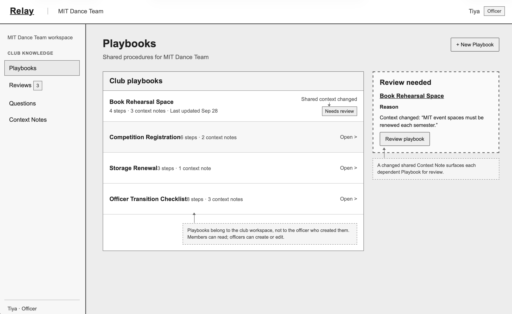
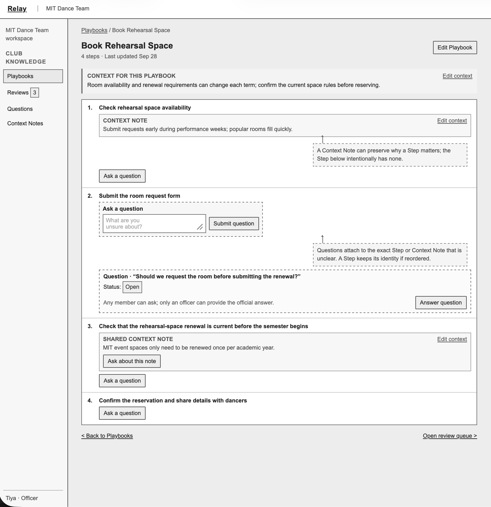
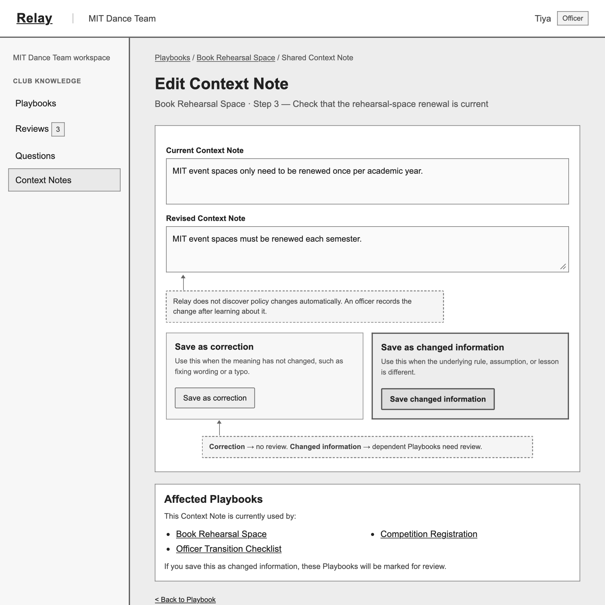
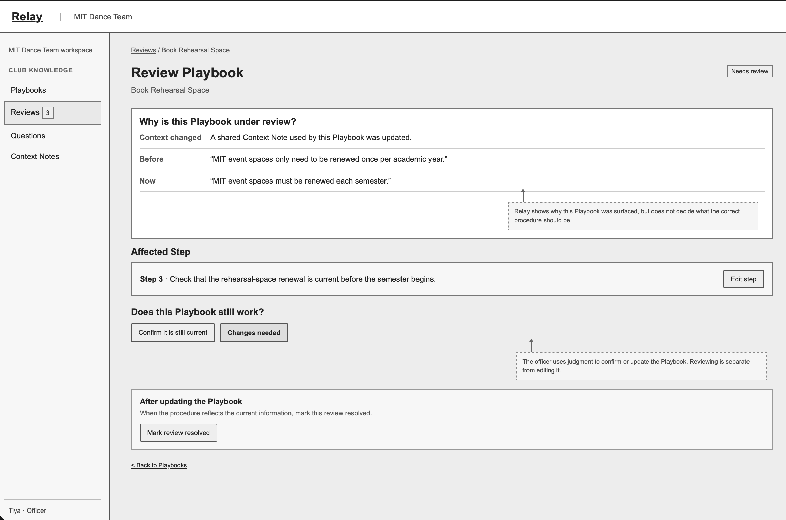

# Relay: preserving club knowledge across handoffs

Relay helps student clubs preserve recurring procedures and the context behind them, so incoming officers can understand inherited work and reconsider it when circumstances change.

This README is the entry point to the complete design submission. Each section links to its full design document or prototype.

## Problem framing and stakeholders

See [Problem framing](./problem-framing.md) for the domain, stakeholder needs, observed handoff problems, and the opportunity Relay addresses.

## Application pitch

See the [Application pitch](./application-pitch.md) for Relay's Quick Playbooks, optional Context Notes, and Change Check features.

## Concept specifications, essential reactions, and concept roles

The [Concept design](./concept-design.md) contains the complete concept specifications, essential reactions connecting them, and the explanation of each concept's role in Relay.

## UI sketches

The four low-fidelity UI sketches are shown below:

### Fig. 1. Club workspace / Playbooks

### Fig. 2. Playbook detail

### Fig. 3. Changing a Context Note

### Fig. 4. Reviewing an affected Playbook

## User journey

See the [User journey](./user-journey.md) for Tiya's path from inheriting a playbook, to recording changed shared context, to reviewing the procedure that depends on it.
