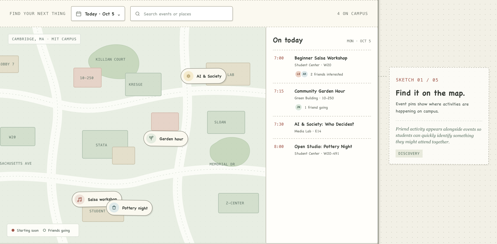
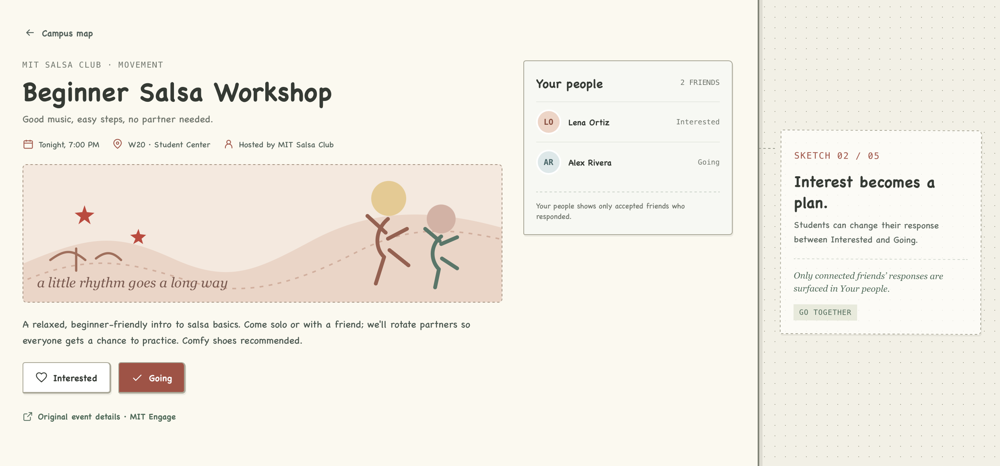
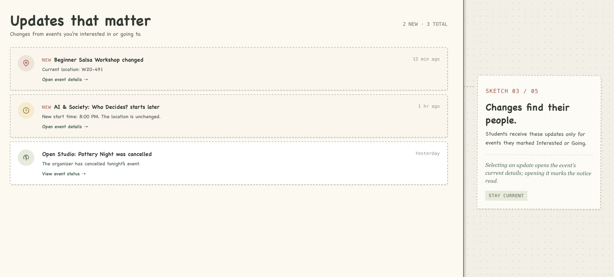
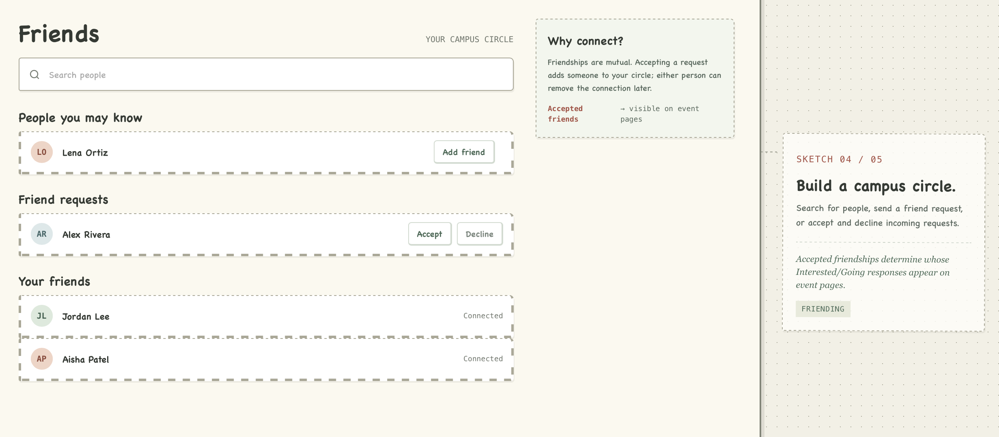
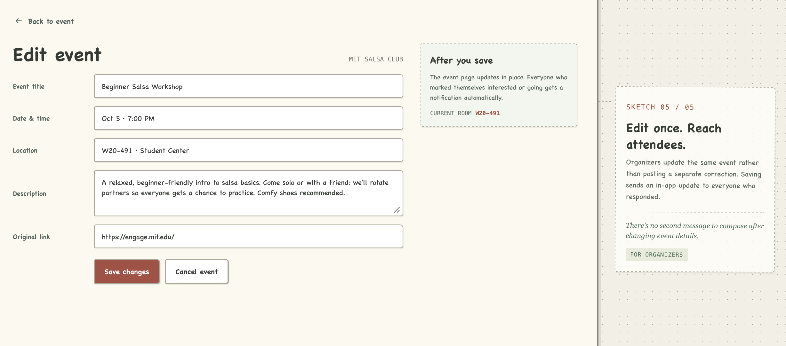

# P1: Design — Loop

## Problem Framing

### Domain

MIT students attend club meetings, workshops, performances, talks, study breaks, and social gatherings to explore interests, take a break from coursework, and meet people. Student groups organize these activities, advertise them, answer questions, and update details when plans change. Students encounter announcements through mailing lists, club social media, university calendars, posters, and messages from friends.

Choosing an event involves more than finding its time and location. A student may want to know whether friends are interested or whether the details have changed since the event was first announced. Organizers want announcements to reach interested students and later updates to reach people already planning to attend.

This project focuses on the gap between **discovering a campus event and successfully showing up to it**. The intended users are MIT students and student-group organizers.

### Bad Situations

#### Interest never becomes a plan

A student sees an announcement for a beginner dance workshop and saves it. She would like to attend but does not know anyone going. She asks her usual group chat, but nobody responds before the workshop starts, so she stays home.

The next day, she learns that a friend outside that group chat had also considered attending. Both students were interested, but neither knew about the other's interest when it would have helped them make a plan.

The event announcement itself succeeded. The failure happened afterward: interest existed, but it never became a shared plan.

#### An update fails to reach an interested student

A club announces a workshop through email and social media. Later, the room becomes unavailable, and the organizer posts a correction on one channel.

A student who saved the original announcement never sees the correction. She walks to the old room, searches through messages, and arrives after the introduction. Meanwhile, the organizer answers repeated questions about the location.

The new information existed, but it did not reach the people who needed it because the original announcement and the update traveled through different channels.

### Corroboration

MIT's DormCon describes Dormspam as a collection of email lists used to distribute information about clubs and campus events.[1] MIT's Student Information Processing Board documents DormSoup, which automatically extracts event details from those emails.[2] DormSoup's creator explains that scattered announcements made it difficult to see upcoming activities and reports approximately 960 student users in August 2024.[3]

This supports the idea that consolidating MIT event information addresses a real problem. It also means that simply building another event aggregator would not be enough to distinguish this project.

Research also supports the social hesitation in the first bad situation. Ratner and Hamilton's study, “Inhibited from Bowling Alone,” found that people can hesitate to take part in enjoyable public activities alone because of concerns about how others perceive them.[4] This supports investigating whether knowing a potential companion affects attendance. It does not establish how often MIT students miss events for this reason.

The same research provides useful counterevidence: people can overestimate how much having company affects their enjoyment.[4] Loop should therefore help people find company without suggesting that an event is only worthwhile when friends attend.

Existing products already solve parts of this workflow. Partiful supports social event discovery, responses, updates, and shared event information.[5][6] MIT Engage provides an established university platform for student organizations and events.[7]

The evidence is strongest for fragmented event discovery and for social hesitation in general. Evidence for how often MIT students specifically miss event changes remains limited, so that part of the problem is a hypothesis to test rather than an established fact.

The opportunity is therefore narrower than “students need an event app.” Existing tools are good at **announcing** events. The overlooked gap comes afterward: students still reconstruct social coordination and later changes across separate channels before they can actually show up.

### Workarounds and Comparables

| Existing approach | What it already provides | What Loop would contribute |
| --- | --- | --- |
| **Dormspam, club social accounts, and group chats** | Familiar places to advertise events, ask friends, and post corrections. | One event page connecting current details with friends' shared interest so students do not have to reconstruct information across multiple conversations. |
| **MIT Engage and university calendars** | An established campus destination for groups and event information. | A visual experience centered on choosing activities with friends and staying current after showing interest. |
| **DormSoup** | Automatically collects MIT event information from Dormspam and makes it easier to browse. | A social layer around event information: friend relationships, shared interest, and direct updates for students already considering an event. |
| **Partiful** | Events, responses, organizer updates, and social event functionality. | An MIT-specific campus map that makes spatial discovery across many activities the starting point rather than a single hosted event page. |

The opportunity is a simpler path from **“this interests me”** to **“I know who might join me and I have the latest details.”** The project tests that path within one campus rather than claiming to invent social event discovery.

### Solution Sketch

A possible solution is a live campus event website where students log in, add friends, and browse activities on a map.

Each event has one page containing its location, time, organizer, description, and any external registration or announcement link. Students can mark themselves **Interested** or **Going**. When viewing an event, a student can see which of their accepted friends have also responded. This helps students identify someone to invite without sending the same announcement into several group chats.

Student-group organizers can create and edit events. When an organizer changes the room, time, or event status, the same event page updates and students who previously marked themselves Interested or Going receive an in-app notification.

“Going” describes a student's plan. It does not reserve a ticket or claim that the student is physically present.

“Live” means that published event changes and attendance responses are reflected in the application as they occur. It does not mean that the application tracks users' physical locations or predicts crowd size.

To keep the project implementable, the first version covers a small manually entered set of MIT events and uses known campus locations for map pins. Automated collection across websites, email, and social media is a possible later extension, but it is not required for the central workflow to be useful.

A pilot should measure whether students use the map to discover events, whether shared friend interest helps turn interest into plans, and whether event updates reach interested students before they travel to an outdated location.

### Stakeholders

**MIT students.** Students discover events, mark whether they are interested or going, connect with friends, and receive updates to events they care about.

**Student-group organizers.** Organizers publish event information and update it when plans change. They benefit when students can find current information without repeatedly messaging the organizer.

---

## Application Pitch

### Loop

**Motivation.** MIT students constantly hear about interesting events, but information is scattered across email, social media, calendars, and group chats. Even after finding an event, students may not know who else wants to go or whether important details have changed.

**Live Campus Map.** Loop opens to a map of MIT showing upcoming events where they are actually taking place. Students can quickly see what is happening around campus and open one event page containing the current time, location, description, organizer, and original registration link. The map reduces the effort of searching through unrelated announcements while giving organizers another way for interested students to discover their events.

**Go Together.** Students can mark an event **Interested** or **Going** and see which of their accepted friends have done the same. Instead of sending an event into several group chats and hoping the right person responds, a student can immediately see whether someone they know is considering it. This helps students turn individual interest into an actual plan and gives organizers a better chance of converting event awareness into attendance.

**Stay in the Loop.** Organizers update an event's time, room, or status on the same event page. Students who previously marked themselves Interested or Going receive an in-app notification when something changes. Students are less likely to arrive at an outdated location, while organizers spend less time answering repeated questions or reposting corrections across multiple channels.

Loop does not try to replace Dormspam, MIT Engage, or club social media. It connects three steps that currently happen across separate tools: **finding something to do, finding someone to go with, and knowing the latest details when it is time to show up.**

---

# Concept Design

Loop uses four concepts:

1. `EventPublishing`
2. `Attending`
3. `Friending`
4. `Notifying`

The campus map is deliberately **not** a concept. It is a user interface for presenting event state. Authentication is also outside these four core concepts; the application assumes an authenticated `User` identity.

## Concept 1: EventPublishing

```text
concept EventPublishing [User, Place]

types
  Status is ACTIVE or CANCELLED

purpose
  keep published event information current;
  prevents attendees from relying on stale event details

principle
  an organizer creates an event with its current details;
  the organizer can later revise the same event as plans change;
  if the event will no longer happen, the organizer cancels it

state
  a set of Events with
    an owner User
    a title String
    a description String
    a place Place
    a start DateTime
    a sourceUrl String
    a status Status

actions
  create (
    owner: User,
    title: String,
    description: String,
    place: Place,
    start: DateTime,
    sourceUrl: String
  ): (event: Event)
    then create a new event with the supplied owner, title, description,
      place, start, and sourceUrl, with status ACTIVE
      and return event

  edit (
    owner: User,
    event: Event,
    title: String,
    description: String,
    place: Place,
    start: DateTime,
    sourceUrl: String
  )
    where event exists
      and event's owner is owner
      and event's status is ACTIVE
    then replace the event's title, description, place, start,
      and sourceUrl with the supplied values

  cancel (owner: User, event: Event)
    where event exists
      and event's owner is owner
      and event's status is ACTIVE
    then set the event's status to CANCELLED
```

## Concept 2: Attending

```text
concept Attending [User, Activity]

types
  AttendanceStatus is INTERESTED or GOING

purpose
  make intentions to participate explicit and revisable;
  prevents plans from remaining implicit or stale

principle
  a user records that they are Interested in or Going to an activity;
  if their plan changes, they can change the response;
  if they no longer want a response recorded, they remove it

state
  a set of Responses with
    a user User
    an activity Activity
    a status AttendanceStatus
    unique user and activity

actions
  respond (
    user: User,
    activity: Activity,
    status: AttendanceStatus
  ): (response: Response)
    where no response exists for this user and activity
    then create a response for user and activity with status
      and return response

  change (
    user: User,
    activity: Activity,
    status: AttendanceStatus
  )
    where a response exists for this user and activity
      and that response's status is not status
    then set that response's status to status

  remove (user: User, activity: Activity)
    where a response exists for this user and activity
    then remove that response
```

## Concept 3: Friending

```text
concept Friending [User]

purpose
  establish mutually agreed social connections;
  prevents one user from unilaterally claiming another as a friend

principle
  one user sends another a friend request;
  if the receiver accepts, the users become friends;
  either friend can later remove the friendship

state
  a set of Requests with
    a sender User
    a receiver User

  a set of Friendships with
    a first User
    a second User

  Rule: no Request or Friendship connects a user to themself
  Rule: at most one Request exists for any unordered pair of Users
  Rule: at most one Friendship exists for any unordered pair of Users
  Rule: no unordered pair of Users has both a Request and a Friendship

actions
  request (
    sender: User,
    receiver: User
  ): (request: Request)
    where sender is not receiver
      and no friendship exists between sender and receiver in either order
      and no request exists between sender and receiver in either direction
    then create a request from sender to receiver
      and return request

  accept (
    receiver: User,
    request: Request
  ): (friendship: Friendship)
    where request exists
      and request's receiver is receiver
      and no friendship exists between request's sender and receiver
        in either order
    then create a friendship between request's sender and receiver
      and remove request
      and return friendship

  decline (
    receiver: User,
    request: Request
  )
    where request exists
      and request's receiver is receiver
    then remove request

  remove (
    user: User,
    friendship: Friendship
  )
    where friendship exists
      and user is one of the friendship's two users
    then remove friendship
```

## Concept 4: Notifying

```text
concept Notifying [User, Item]

purpose
  preserve relevant updates until their recipients see them;
  prevents important changes from being missed

principle
  when a notification about an item is created for a user,
  it remains unread until that user marks it as read

state
  a set of Notifications with
    a recipient User
    an item Item
    a message String
    a read Flag

actions
  notify (
    recipient: User,
    item: Item,
    message: String
  ): (notification: Notification)
    then create a notification with the supplied recipient, item, and message,
      with read set to false
      and return notification

  markRead (
    user: User,
    notification: Notification
  )
    where notification exists
      and notification's recipient is user
      and notification's read flag is false
    then set notification's read flag to true
```

---

# Essential Reactions

The reactions below supply the application-specific links while leaving the concepts themselves independent.

## Record a response only for an active event

```text
reaction respondToActiveEvent
when Requesting.setEventResponse (user, event, status)
where
  EventPublishing: event exists and has status ACTIVE
  Attending: no Response exists with user user and activity event
then
  Attending.respond (user, activity: event, status)
```

## Change an existing response only for an active event

```text
reaction changeActiveEventResponse
when Requesting.setEventResponse (user, event, status)
where
  EventPublishing: event exists and has status ACTIVE
  Attending: a Response exists with user user and activity event
    whose status is not status
then
  Attending.change (user, activity: event, status)
```

A response can still be removed after an event is cancelled, so removal does not need the active-event condition.

## Notify responders when an event changes

```text
reaction notifyEventUpdate
when EventPublishing.edit (event: event)
where Attending: a Response exists with user responder and activity event
then
  Notifying.notify (
    recipient: responder,
    item: event,
    message: "An event you responded to has changed."
  )
```

This reaction fires once for each `responder` satisfying the `where` condition.

## Notify responders when an event is cancelled

```text
reaction notifyEventCancellation
when EventPublishing.cancel (event: event)
where Attending: a Response exists with user responder and activity event
then
  Notifying.notify (
    recipient: responder,
    item: event,
    message: "An event you responded to has been cancelled."
  )
```

## Friend-filtered attendance display

No state-changing reaction is needed to render **Your people**. The interface reads the visible states of `Friending` and `Attending` and displays a user's event response only when a `Friendship` connects that user to the viewer. There is no public attendee list elsewhere in the proposed interface.

---

## Concept Roles and Type Instantiations

`EventPublishing` owns the event lifecycle and current event details. `Attending` independently records a user's participation intention. `Friending` independently records mutual social connections. `Notifying` stores notifications without deciding why a notification should exist; the reactions above supply that application-specific decision.

The generic types are instantiated as follows: all four `User` parameters refer to the application's authenticated users; `Attending.Activity` is instantiated with `EventPublishing.Event`; `Notifying.Item` is instantiated with `EventPublishing.Event`; and `EventPublishing.Place` is instantiated with the campus locations used for map pins.

The map is simply a presentation of active `EventPublishing` state. The initial project does not model automated event scraping, ratings, comments, photo sharing, ticketing, or physical location tracking. These are intentionally excluded because they are not necessary for the three central workflows.

---

# UI Sketches

These sketches communicate the main interface layout and annotate the less-obvious relationships between event locations, friend activity, attendance responses, and updates.

## Sketch 1: Campus Map



The home page shows:

- a map of MIT
- event pins attached to campus locations
- a date/time filter
- a small list of upcoming events
- friend activity alongside relevant events

Selecting an event opens its event page.

Event pins show where activities are happening on campus. Friend activity appears alongside events so students can quickly identify something they might attend together.

## Sketch 2: Event Page



The event page shows:

- event title
- date and time
- building/location
- organizer
- short description
- original announcement or registration link
- **Interested** button
- **Going** button
- **Your people**, showing accepted friends who responded

Students can change their response between **Interested** and **Going**. **Your people** shows only accepted friends who responded.

## Sketch 3: Notifications



The notifications page shows changes from events the student marked **Interested** or **Going**, such as:

> **Beginner Salsa Workshop changed**  
> Current location: W20-491  
> **Open event details →**

Selecting an update opens the event's current details. The event page, rather than the notification itself, is the authoritative source for the latest room and time. Opening the notification allows it to be marked as read.

## Sketch 4: Friends



Students can search for people, send a friend request, and accept or decline incoming requests.

Friendships are mutual. Accepted friendships determine whose **Interested** and **Going** responses appear in **Your people** on event pages.

## Sketch 5: Organizer Event Editor



The organizer view contains fields for:

- title
- date/time
- building/location
- description
- original registration or announcement link

The organizer can save changes or cancel the event.

Saving changes updates the same event rather than creating a separate correction. Students who have already responded to the event are notified automatically, so the organizer does not need to compose and distribute a second update message.

---

# User Journey

Maya is an MIT student walking back from class when she realizes she has no plans for the evening. She remembers seeing several club emails during the week but does not want to search through her inbox again.

She opens Loop. On the campus map in **Sketch 1**, she sees several events happening that evening. One pin near the Student Center is a beginner salsa workshop. She selects it and opens the event page in **Sketch 2**.

The workshop sounds fun, but Maya is unsure whether she wants to go alone. Lena is already one of Maya's accepted friends in Loop, a relationship represented by the Friends interface in **Sketch 4**. On the event page, Maya sees that Lena has marked herself **Interested**. Maya now knows exactly whom to message instead of sending the announcement to a large group chat. She marks herself **Going**, messages Lena, and they make plans to attend together.

An hour before the workshop, the organizers lose access to their original room. An organizer opens the event editor in **Sketch 5** and changes the location. The same event is updated rather than replaced by a separate correction.

Because Maya has an attendance response for the event, Loop creates a notification for her. Maya sees the update in **Sketch 3** before leaving her dorm. Opening it takes her back to the same event page, now showing the current room.

Maya and Lena arrive at the correct place on time.

No individual step in this journey is impossible with today's tools. Maya could search Dormspam, ask several group chats, follow the organizer's social media account, and repeatedly check for changes. Loop removes the need to reconstruct that chain every time: the event, the people considering it, and its current information stay connected.

---

# Sources

1. MIT DormCon. [Join Dormspam!](https://dormcon.mit.edu/resources/join-dormspam).
2. MIT Student Information Processing Board. [Projects: DormSoup](https://sipb.mit.edu/projects/).
3. Andi Liu. [DormSoup — GPT-Powered Eventbrite](https://andiliu.me/blogs/dormsoup). August 20, 2024.
4. Ratner, R. K., and Hamilton, R. W. [Inhibited from Bowling Alone](https://academic.oup.com/jcr/article/42/2/266/1816188). *Journal of Consumer Research*, 42(2), 266–283, 2015.
5. Partiful. [What is the Partiful Explore page?](https://help.partiful.com/en-us/articles/15525568-what-is-the-partiful-explore-page).
6. Partiful. [Product description on the App Store](https://apps.apple.com/us/app/partiful-party-invite-maker/id1662982304).
7. MIT Engage. [Campus platform](https://engage.mit.edu/home_login).
